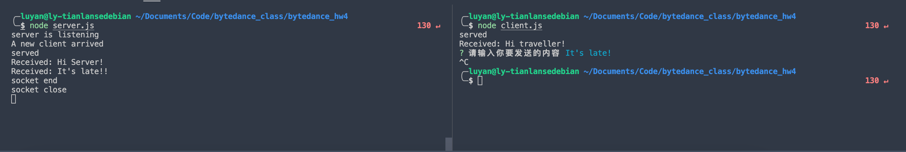

# Bytedance_hw4

**【介绍】**

参考开源项目摸索了一下，实现自定义应用层协议

* 定义了协议的规范
* 实现协议的解析器
* 使用 Node.js 的 net 模块实现两个进程基于该协议进行通信
* 使用了inquirer进行用户交互

**【使用方法】**

1. 使用进入文件夹
2. `node server.js`: 启动server
3. `node client.js`: 启动client
4. 根据提示，发送消息
5. 在server上查看
6. `control +c`退出
